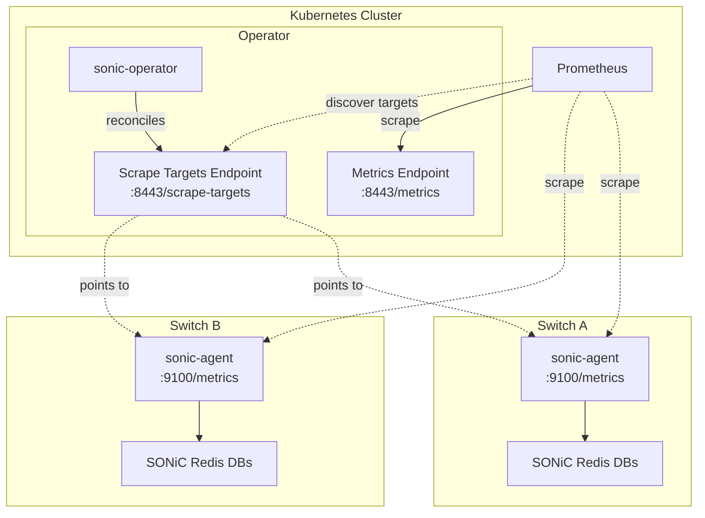

# IEP-13: Prometheus Metrics for the SONiC Operator and Managed Switches

## Table of Contents

- [IEP-13: Prometheus Metrics for the SONiC Operator and Managed Switches](#iep-13-prometheus-metrics-for-the-sonic-operator-and-managed-switches)
  - [Table of Contents](#table-of-contents)
  - [Summary](#summary)
  - [Motivation](#motivation)
    - [Goals](#goals)
    - [Non-Goals](#non-goals)
  - [Proposal](#proposal)
    - [Architecture Overview](#architecture-overview)
    - [Operator Metrics](#operator-metrics)
    - [Switch Agent Metrics](#switch-agent-metrics)
      - [Redis Data Sources](#redis-data-sources)
      - [Data Categories](#data-categories)
      - [Mapping Configuration](#mapping-configuration)
      - [Naming and Labeling Conventions](#naming-and-labeling-conventions)
    - [Prometheus Service Discovery](#prometheus-service-discovery)
    - [Labeling Strategy](#labeling-strategy)
    - [Staleness and Failure Modes](#staleness-and-failure-modes)
  - [Alternatives](#alternatives)
    - [Alternative 1: Operator as single metrics proxy](#alternative-1-operator-as-single-metrics-proxy)
    - [Alternative 2: gNMI with Telegraf](#alternative-2-gnmi-with-telegraf)
    - [Alternative 3: SNMP with snmp\_exporter or Telegraf](#alternative-3-snmp-with-snmp_exporter-or-telegraf)
    - [Alternative 4: Agent pushes to Pushgateway](#alternative-4-agent-pushes-to-pushgateway)

## Summary

The sonic-operator manages external SONiC switches via a gRPC agent (`switch-agent`) that runs on each switch.

This proposal defines metrics generation and collection via prometheus for two scrape sources:

1. **sonic-operator**  
   operator-internal metrics: agent reachability, reconciliation health, CR state distribution, and ZTP provisioning. These are recorded directly in the operator process.
2. **sonic-agent**  
   switch domain metrics: interface state including SFP transceiver health and error counts, port counts, device readiness, chassis health, device info.
   Each agent serves a `/metrics` HTTP endpoint that performs just-in-time reads from the local SONiC Redis databases on every scrape. Mapping from Redis to Prometheus is done via configuration, with sensible defaults and operator overrides.

Prometheus discovers switch agents via a headless Service and Endpoints resource managed by the operator, following the same ServiceMonitor pattern already used for operator metrics.

## Motivation

Exposing Prometheus metrics for the operator and the switches it manages enables:

- **Fleet-wide observability.** A single dashboard can show interface operational states, port counts, device readiness and physical properties across all switches, making it easy to spot trends, issues and outliers.
- **Proactive alerting.** Alerting rules such as "switch unreachable for > 5 minutes" or "SFP signal strength outside limits" allow the team to respond to issues before they escalate.
- **Faster root-cause analysis.** When a reconciliation fails, metrics on agent reachability and per-switch state narrow down whether the cause is network connectivity, agent health, or data inconsistency.

### Goals

- Expose operator-internal metrics: agent reachability, reconciliation outcomes, CR state distribution, and ZTP provisioning.
- Expose switch domain metrics directly from each agent: interface counts by status, per-interface admin/operational state, standard traffic counters (bytes, packets, discards), error and anomaly counters, FEC statistics, interface queue depth, SFP transceiver health (DOM sensors, thresholds, status flags, static info), fan and temperature sensor readings, port count, device readiness, and firmware version, served via a `/metrics` HTTP endpoint on each switch agent.
- Drive the Redis-to-metric mapping from a YAML configuration file on the agent. Ship a default config covering common operational categories; operators can add, remove, or override mappings without rebuilding the agent.
- Operator manages a headless Service and Endpoints resource so Prometheus discovers agents automatically as Switch CRs are created or deleted.
- Reuse existing Prometheus Operator patterns (ServiceMonitor, label-based selection) for both scrape targets.

### Non-Goals

- Push-based telemetry (e.g. OTLP Collector on each switch). Pull-based scraping is the established pattern in this stack; push-based export can be evaluated separately.
- Adding Grafana dashboards or alerting rules. These belong in deployment-specific configuration and will be handled in a different enhancement proposal.

## Proposal

Metrics are exposed at the source. For the `sonic-operator` this is the regular operator metrics. For the managed switches this is each switch itself, which is identified via address metadata in Kubernetes.

Prometheus is chosen as data representation and as retrieval model, i.e. pull-based retrieval.

### Architecture Overview



There are two independent Prometheus scrape paths:

1. **sonic-operator**: Prometheus scrapes the operator on `:8443` for operator-internal metrics (reachability, reconciliation, CR state, ZTP).
2. **sonic-agent(s)**: Prometheus scrapes each agent on `:9100`, identified via the scrape targets list in the sonic-operator to retrieve switch domain metrics (interfaces, ports, readiness, device info, traffic counters, error and anomaly counters, queue depth, SFP transceiver health, fan and temperature sensor readings). Each scrape triggers just-in-time reads from the local SONiC Redis databases.  
   There may be cases where metrics are not stored in the Redis DB and need to be derived programmatically. None are known as of writing.

The operator communicates with agents over gRPC (`:50051`) for reconciliation. This gRPC connection is also used to probe agent reachability.

### Operator Metrics

These track how well the operator itself is functioning. They are recorded directly in the operator process:

- **Agent reachability:** reachability and last-contact timestamp for alerting
- **Reconciliation metrics:** already covered by controller-runtime defaults
- **CR state distribution:** gauges counting `Switch` and `SwitchInterface` CRs by state (`Pending`/`Ready`/`Failed`). 
- **ZTP provisioning:** request counts and timestamps recorded when switches fetch their provisioning script from the operator's ZTP handler. ZTP and ONIE related provisioning metrics will need to be collected, but will be specified once we have a working implementation.

### Switch Agent Metrics

Each switch agent serves a `/metrics` HTTP endpoint on `:9100`. On every Prometheus scrape, the agent performs just-in-time reads from the local SONiC Redis databases and returns the current state. There is no caching of dynamic metrics; each scrape reflects the live state of the switch. Static metadata (firmware version, HWSKU, ASIC type, MAC address) changes only on upgrade or re-provisioning and with that sonic-agent restart, and may therefore be cached.

The mapping from Redis paths to Prometheus metrics is driven by a configuration file on the agent. The agent ships with a default configuration covering the data categories below. Operators can add, remove, or override individual mappings without rebuilding the agent by providing an alternative mapping configuration.

#### Redis Data Sources

| Category | Redis DB | Example Keys |
|---|---|---|
| Device metadata | CONFIG_DB | `DEVICE_METADATA\|localhost` |
| Interface oper status | STATE_DB | `PORT_TABLE\|Ethernet*` |
| Interface admin status | CONFIG_DB | `PORT\|Ethernet*` |
| Port configuration | APPL_DB | `PORT_TABLE:Ethernet*` |
| SFP DOM sensors | STATE_DB | `TRANSCEIVER_DOM_SENSOR\|Ethernet*` |
| SFP DOM thresholds | STATE_DB | `TRANSCEIVER_DOM_THRESHOLD\|Ethernet*` |
| SFP DOM flags | STATE_DB | `TRANSCEIVER_DOM_FLAG\|Ethernet*` |
| Transceiver info | STATE_DB | `TRANSCEIVER_INFO\|Ethernet*` |
| Transceiver status | STATE_DB | `TRANSCEIVER_STATUS\|Ethernet*` |
| Interface error counters | COUNTERS_DB | `COUNTERS:<oid>` via `COUNTERS_PORT_NAME_MAP` |
| Temperature sensors | STATE_DB | `TEMPERATURE_INFO\|*` |

This reuses the same Redis access patterns already implemented in the agent's existing gRPC RPCs (`GetDeviceInfo`, `ListInterfaces`, etc.).

Thanks to the configuration, other metrics can be added when they are desired, or a database schema change requires.

#### Data Categories

The default configuration covers the following data categories:

* **Device metadata** (CONFIG_DB): firmware version, HWSKU, ASIC type, platform, MAC address. Exposed via the `_info` gauge pattern (a gauge always set to 1, with metadata as labels). Data rarely changes and is useful for fleet inventory queries, filtering and joins with other time series.

* **Interface state and traffic counters** (STATE_DB, CONFIG_DB, COUNTERS_DB): admin and operational status per interface, aggregate interface counts by status, and total port count. Standard traffic counters: bytes transferred, packet counts by type (unicast, multicast, broadcast), discards, and SAI-level drops, all per interface and direction. Interface output queue depth. The primary signals for interface health and traffic analysis.

* **Interface error and anomaly counters** (COUNTERS_DB): aggregate error counters per interface and direction, plus anomaly counters for malformed or unexpected traffic (fragments, jabbers, oversize, undersize, unknown protocols). FEC correctable, uncorrectable, and symbol error frame counts. All are monotonically increasing counters (`_total` suffix). COUNTERS_DB stores values keyed by OID rather than interface name; the agent resolves interface names internally via `COUNTERS_PORT_NAME_MAP` so the metric config does not need to know about OIDs.

* **SFP transceiver health** (STATE_DB): four related metric groups:
  - *DOM sensor readings:* temperature, voltage, TX/RX power, bias current per lane.
  - *DOM thresholds:* warning and alarm thresholds (high/low) per sensor.
  - *Transceiver status:* per-lane RX loss-of-signal and TX fault indicators, each a gauge (1 = fault/loss, 0 = ok).
  - *Transceiver static info:* SFP type, vendor, serial number, model. Exposed as an `_info` gauge.

  Helps detect degradation of optical links before traffic is affected.

* **Chassis health** (STATE_DB): fan and temperature sensor readings. Per-sensor temperature gauges, high-threshold gauges, and warning status indicators. Useful for monitoring the physical health of the switch chassis and alerting on thermal anomalies.

* **Device readiness:** an overall switch readiness gauge (1 = ready, 0 = not ready).

> **Note:** Neighbor discovery (LLDP) data is managed by the operator, not exposed as agent metrics.

#### Mapping Configuration

The YAML config file defines how Redis data maps to Prometheus metrics. Each entry specifies:

- `redis_db` + `key_pattern`: which Redis hash keys to read. Support for wildcards (`*`)
- `fields`: which hash fields to extract
- Per-field: `metric` name, `type` (gauge / counter), `labels` (with variable references for dynamic values), and optional `transform` for enum mapping or derived values

The following excerpt illustrates representative patterns from the default config:

```yaml
# Interface operational state: simple gauge derived from a string field
- redis_db: STATE_DB
  key_pattern: "PORT_TABLE|*"
  fields:
    - field: oper_status
      metric: sonic_switch_interface_oper_state
      type: gauge
      labels:
        interface: "$key_suffix"              # Ethernet0, Ethernet4, ...
      transform:
        map: { up: 1, down: 0 }

# Interface error counters: counter with direction label, OID resolved internally
- redis_db: COUNTERS_DB
  key_pattern: "COUNTERS:*"
  key_resolver: COUNTERS_PORT_NAME_MAP        # agent resolves OID → port name
  fields:
    - field: SAI_PORT_STAT_IF_IN_ERRORS
      metric: sonic_switch_interface_errors_total
      type: counter
      labels:
        interface: "$port_name"
        direction: "rx"
    - field: SAI_PORT_STAT_IF_OUT_ERRORS
      metric: sonic_switch_interface_errors_total
      type: counter
      labels:
        interface: "$port_name"
        direction: "tx"
    - field: SAI_PORT_STAT_IF_IN_FEC_CORRECTABLE_FRAMES
      metric: sonic_switch_interface_fec_frames_total
      type: counter
      labels:
        interface: "$port_name"
        type: "correctable"
    - field: SAI_PORT_STAT_IF_IN_FEC_NOT_CORRECTABLE_FRAMES
      metric: sonic_switch_interface_fec_frames_total
      type: counter
      labels:
        interface: "$port_name"
        type: "uncorrectable"
    - field: SAI_PORT_STAT_IF_IN_FEC_SYMBOL_ERRORS
      metric: sonic_switch_interface_fec_frames_total
      type: counter
      labels:
        interface: "$port_name"
        type: "symbol_errors"

# Transceiver info: _info pattern with static metadata as labels
- redis_db: STATE_DB
  key_pattern: "TRANSCEIVER_INFO|*"
  fields:
    - metric: sonic_switch_transceiver_info
      type: gauge
      value: 1                                # always 1, metadata in labels
      labels:
        interface: "$key_suffix"
        vendor: "$vendor_name"
        model: "$model_number"
        serial: "$serial_number"
        type: "$type"

# SFP DOM thresholds: single metric, dimensions as labels
- redis_db: STATE_DB
  key_pattern: "TRANSCEIVER_DOM_THRESHOLD|*"
  field_pattern: "*"                          # iterate all threshold fields
  transform:
    parse_threshold_field: true               # field name encodes sensor/level/direction
  metric: sonic_switch_transceiver_dom_threshold
  type: gauge
  labels:
    interface: "$key_suffix"
    sensor: "$sensor"                         # temperature, voltage, rx_power, ...
    level: "$level"                           # warning, alarm
    direction: "$direction"                   # high, low

# Transceiver status: per-lane RX loss-of-signal and TX fault
- redis_db: STATE_DB
  key_pattern: "TRANSCEIVER_STATUS|*"
  fields:
    - field_pattern: "rxlos*"
      metric: sonic_switch_transceiver_rxlos
      type: gauge
      labels:
        interface: "$key_suffix"
        lane: "$lane"                             # extracted from field name
      transform:
        map: { "True": 1, "False": 0 }
    - field_pattern: "txfault*"
      metric: sonic_switch_transceiver_txfault
      type: gauge
      labels:
        interface: "$key_suffix"
        lane: "$lane"
      transform:
        map: { "True": 1, "False": 0 }
```

#### Naming and Labeling Conventions

The default config follows Prometheus naming best practices:

- **Prefix:** all agent-emitted metrics use a common prefix (e.g. `sonic_switch_`)
- **Units in names:** sensor metrics include the unit, e.g. `_celsius`, `_dbm`, `_volts`, `_milliamps`. Counters use `_total`.
- **`_info` pattern:** static metadata (device info, transceiver info) is a gauge set to 1 with metadata as labels, enabling `group_left` joins.
- **Labels from Redis key structure:** the key suffix (the part after `|` or `:`) becomes the `interface` label. For COUNTERS_DB, the agent resolves OIDs to port names internally.
- **Cardinality control:** related values are grouped under a single metric name with label dimensions (e.g. `direction=rx|tx`, `sensor=temperature|voltage|...`, `level=warning|alarm`, `type=correctable|uncorrectable`) rather than creating separate metric names per variant.
- **No `switch_name` from the agent:** the agent does not emit a `switch_name` label. It is added at scrape time by Prometheus via ServiceMonitor relabeling (see [Labeling Strategy](#labeling-strategy)).

### Prometheus Service Discovery

The `prometheus-operator` provides various service discovery mechanisms, most of which are available only to standard Kubernetes resources (`Pod`, `Service`, `Endpoint`, etc) but not for arbitrary CRDs via labels.

The `sonic-operator` exposes an HTTP service discovery endpoint that returns the current list of switch scrape targets. Prometheus consumes this via [`http_sd_configs`](https://prometheus.io/docs/prometheus/latest/configuration/configuration/#http_sd_config), which polls the endpoint periodically to discover new or removed switches.

This avoids creating synthetic Kubernetes resources (e.g. headless Services or Endpoints per switch) solely for discovery purposes, while keeping the target list in sync with the `Switch` CR states.

### Labeling Strategy

All switch-related metrics carry a `switch_name` label, derived from the `Switch` CR `.metadata.name`. The Switch CR is cluster-scoped, so there is no namespace information. 

| Label | Source | Applied By | Example |
|---|---|---|---|
| `switch_name` | `Switch` CR `.metadata.name` | ServiceMonitor relabeling (agent metrics) or directly by operator code (operator metrics) | `leaf-01` |

Static metadata (firmware version, HWSKU, ASIC type, MAC address) uses the `_info` pattern: a gauge always set to 1 with metadata as labels. These values are read directly from Redis by the agent on each scrape.

**Example metrics from agent scrape** (`:9100` on the switch):

```
# Device metadata (CONFIG_DB), _info pattern
sonic_switch_info{mac="aa:bb:cc:dd:ee:ff", firmware="4.2.0", hwsku="Accton-AS7726-32X", asic="broadcom", platform="x86_64-accton_as7726_32x-r0"} 1

# Device readiness and aggregate counts
sonic_switch_ready 1
sonic_switch_interfaces_total{operational_status="up"} 47
sonic_switch_interfaces_total{operational_status="down"} 1
sonic_switch_ports_total 48

# Per-interface state
sonic_switch_interface_admin_state{interface="Ethernet0"} 1
sonic_switch_interface_oper_state{interface="Ethernet0"} 1

# Interface traffic counters (COUNTERS_DB)
sonic_switch_interface_bytes_total{interface="Ethernet0", direction="rx"} 6.57e+08
sonic_switch_interface_bytes_total{interface="Ethernet0", direction="tx"} 1.23e+08
sonic_switch_interface_packets_total{interface="Ethernet0", direction="rx", type="unicast"} 1199271
sonic_switch_interface_packets_total{interface="Ethernet0", direction="rx", type="multicast"} 162981
sonic_switch_interface_packets_total{interface="Ethernet0", direction="tx", type="unicast"} 953331
sonic_switch_interface_queue_length{interface="Ethernet0"} 0

# Interface error and anomaly counters (COUNTERS_DB, OID resolved internally)
sonic_switch_interface_errors_total{interface="Ethernet0", direction="rx"} 42
sonic_switch_interface_errors_total{interface="Ethernet0", direction="tx"} 0
sonic_switch_interface_discards_total{interface="Ethernet0", direction="rx"} 7
sonic_switch_interface_anomaly_packets_total{interface="Ethernet0", type="fragments"} 0
sonic_switch_interface_anomaly_packets_total{interface="Ethernet0", type="jabbers"} 0
sonic_switch_interface_fec_frames_total{interface="Ethernet0", type="correctable"} 1580
sonic_switch_interface_fec_frames_total{interface="Ethernet0", type="uncorrectable"} 0
sonic_switch_interface_fec_frames_total{interface="Ethernet0", type="symbol_errors"} 0

# SFP DOM sensor readings (STATE_DB)
sonic_switch_transceiver_dom_temperature_celsius{interface="Ethernet0"} 32.5
sonic_switch_transceiver_dom_voltage_volts{interface="Ethernet0"} 3.31
sonic_switch_transceiver_dom_rx_power_dbm{interface="Ethernet0", lane="1"} -8.42
sonic_switch_transceiver_dom_tx_bias_milliamps{interface="Ethernet0", lane="1"} 6.75

# SFP DOM thresholds: single metric, dimensions as labels
sonic_switch_transceiver_dom_threshold{interface="Ethernet0", sensor="temperature", level="alarm", direction="high"} 70.0
sonic_switch_transceiver_dom_threshold{interface="Ethernet0", sensor="rx_power", level="warning", direction="low"} -14.0

# Transceiver status: per-lane health indicators
sonic_switch_transceiver_rxlos{interface="Ethernet0", lane="1"} 0
sonic_switch_transceiver_txfault{interface="Ethernet0", lane="1"} 0

# Transceiver static info
sonic_switch_transceiver_info{interface="Ethernet0", vendor="Finisar", model="FTLX8574D3BCL", serial="ABC1234", type="QSFP28"} 1

# Chassis health: temperature sensors (STATE_DB)
sonic_switch_temperature_celsius{sensor="CPU_Package_temp"} 37
sonic_switch_temperature_high_threshold_celsius{sensor="CPU_Package_temp"} 82
sonic_switch_temperature_warning{sensor="CPU_Package_temp"} 0
```

Note: `switch_name` is **not** emitted by the agent. Prometheus adds it at scrape time via the ServiceMonitor relabeling rule, resulting in:

```
sonic_switch_interfaces_total{switch_name="leaf-01", operational_status="up"} 47
```

**Example metrics from operator scrape** (`:8443` on the operator):

```
# Agent reachability (operator's gRPC view)
sonic_switch_agent_reachable{switch_name="leaf-01"} 1
sonic_switch_agent_last_contact_timestamp{switch_name="leaf-01"} 1.742e+09

# CR state distribution (purely Kubernetes-side, no agent needed)
sonic_switches_total{state="Ready"} 18
sonic_switches_total{state="Pending"} 1
sonic_switches_total{state="Failed"} 1
sonic_switch_state{switch_name="leaf-01", state="Ready"} 1
sonic_switch_interfaces_cr_total{state="Ready"} 940
sonic_switch_interfaces_cr_total{state="Failed"} 4

# ZTP provisioning (keyed by switch IP from ZTP config, stable via controlled DHCP)
sonic_ztp_requests_total{switch_ip="2001:db8::1", switch_type="leaf"} 3
sonic_ztp_last_request_timestamp{switch_ip="2001:db8::1", switch_type="leaf"} 1.742e+09
sonic_ztp_render_errors_total{switch_type="leaf"} 1
```

### Staleness and Failure Modes

Because switch domain metrics are served directly by each agent, Prometheus's native staleness handling applies. There is no intermediate caching layer that could serve stale data.

| Scenario | Effect |
|---|---|
| **Agent unreachable from Prometheus** | Scrape fails, `up{switch_name="leaf-01"} = 0`. Prometheus marks all series from that target as stale after the configured staleness period (default 5 minutes). No stale data lingers. |
| **Agent unreachable from operator** | `sonic_switch_agent_reachable{switch_name="leaf-01"} = 0` on the operator scrape. Agent metrics may still be scraped successfully by Prometheus (different network path). |
| **Agent reachable but Redis unhealthy** | Agent returns HTTP 500, `up = 0`. Prometheus treats this the same as a failed scrape. |
| **Switch CR deleted** | Operator removes the address from the scrape targets, and all associated series go stale. |

This is simpler and more correct than the alternative where the operator caches metrics from agents: in that model, when an agent becomes unreachable, the operator would continue serving the last-known values indefinitely, making it impossible to distinguish "switch is healthy" from "switch has been unreachable for hours."

## Alternatives

### Alternative 1: Operator as single metrics proxy

Route all switch domain metrics through the operator: Prometheus scrapes only the operator on `:8443`, the operator polls each agent via a dedicated `GetMetrics` gRPC RPC, and re-exposes the combined results.

**Rejected because:**

- **Scaling bottleneck.** As the fleet grows, the operator becomes a fan-in point for all switch metrics. Polling N agents every 30 seconds adds N × RTT of background work and memory for cached results.
- **Custom staleness logic.** When an agent is unreachable, the operator must decide how long to keep serving last-known values. Getting this wrong means stale data or data gaps. Prometheus already solves this natively via scrape failure detection and configurable staleness.
- **Redundant complexity.** The operator would need a polling loop, a cache with TTLs, and error handling for partial failures, all of which Prometheus provides out of the box for direct scrape targets.
- **Each agent is already network-reachable** from the cluster for gRPC reconciliation. Adding an HTTP `/metrics` endpoint on the same host requires no new network paths.

### Alternative 2: gNMI with Telegraf

Use SONiC's built-in gNMI telemetry interface with a Telegraf collector instead of the custom gRPC agent. Two sub-options exist:

**Option A: OpenConfig YANG models.** Query interface and device data via standard OpenConfig paths (e.g. `/openconfig-interfaces:interfaces`).

**Rejected because:** SONiC's `telemetry` module is extremely slow when serving OpenConfig models, approximately 2 seconds per request to list all interfaces. Additionally, the OpenConfig data is incomplete compared to what SONiC tracks internally; fields available in `STATE_DB` and `ASIC_DB` are not fully represented in the OpenConfig models.

**Option B: gNMI with direct Redis database paths.** SONiC's gNMI server supports querying Redis databases directly (e.g. `COUNTERS_DB`, `STATE_DB`) via SONiC-native paths, which is significantly faster than the OpenConfig path.

**Rejected because:** The gNMI-over-Redis approach mangles result keys: table prefixes are stripped from key names, and when keys from different tables collide, last-write-wins semantics apply. This produces unreliable and ambiguous data. Querying Redis explicitly through the agent, where we control key resolution and table selection, provides deterministic and complete results.

### Alternative 3: SNMP with snmp_exporter or Telegraf

SONiC ships with `snmpd` (`sonic-snmpagent`) out of the box. A Prometheus `snmp_exporter` or Telegraf could poll switches via standard MIBs (IF-MIB, SNMPv2-MIB, LLDP-MIB).

**Rejected because:** Standard MIBs lack SONiC-specific state from `STATE_DB` and `ASIC_DB`. The `sonic-snmpagent` is itself a Python process reading from Redis, adding a slower, less complete intermediary over a path we already cover directly. SNMP also reintroduces the network reachability problem (UDP 161 to every switch), and IF-MIB walks are slow on large interface tables, comparable to the OpenConfig issue in Alternative 2a.

### Alternative 4: Agent pushes to Pushgateway

Each agent pushes metrics to a Prometheus Pushgateway running in the cluster, and Prometheus scrapes the Pushgateway.

**Rejected because:** Pushgateway is designed for short-lived batch jobs, not long-running services. It does not handle staleness: if an agent stops pushing, the last-pushed values persist indefinitely in the Pushgateway with no indication that the source is gone. This is the same stale-data problem as the operator-as-proxy approach (Alternative 1), but worse because there is no operator-side reachability check to flag it. Direct scraping with native Prometheus staleness is the correct model for long-running agents.
