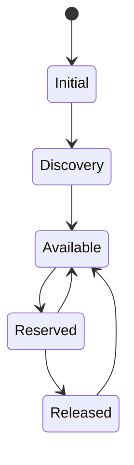

# IEP-17: Server Reclaim State & Policy

## Table of Contents

- [Summary](#summary)
- [Motivation](#motivation)
    - [Goals](#goals)
    - [Non-Goals](#non-goals)
- [Proposal](#proposal)
- [Alternatives](#alternatives)

## Summary

Currently, a `Server` directly transitions from being reserved by a claim
to being available again. However, some operation might need to be done
to cleanse / sanitize / inspect the server before handing it out for claiming
again, depending on the environment the server is running in.

To allow for describing this, the new state `Released` is added to a `Server`.
Additionally, `reclaimPolicy` is added to the `Server`: It can either be
`Recycle` (default) or `Retain`. If the policy is set to `Recycle`, a `Server`
immediately transitions from `Reserved` to `Available` once the using
`ServerClaim` is deleted. If it is set to `Retain`, it will stay in `Released`
state and have the `claimRef` set until an external entity removes the `claimRef`
from the `Server`, indicating that an external reclamation has happened and that
the server can transition to `Available`.

Below is a simplified state transition diagram with the updated states,
excluding the error state.

## Motivation

Currently, when a `Server` is freed from a claim, it becomes claimable right
away again. This causes an issue, as e.g. the disk of the `Server` should be
cleaned or some checks should be run before handing the `Server` out for
claiming it again.

### Goals

- Define an extension point for implementing sanitization or
  any other operation after a server has been claimed.

### Non-Goals

- (Continuously) monitor servers for readiness

## Proposal

Introduce `Server.spec.reclaimPolicy` with two possible values:
* `Recycle` (default): Directly make a server `Available` again
  after use.
* `Retain`: Transition a `Server` to `Released` state after use,
  transitioning it to `Available` once `spec.claimRef` is removed.

## Alternatives

- Use a `MutatingWebHookConfiguration` patching the `Server` with taints
  when it transitions after usage. This however has lots of implicit logic
  and requires some coding + makes the server still available (with taints).